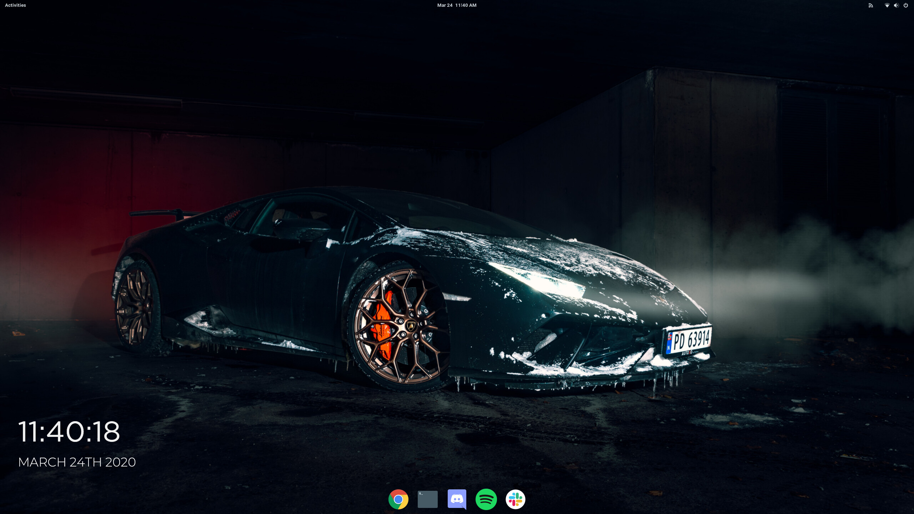
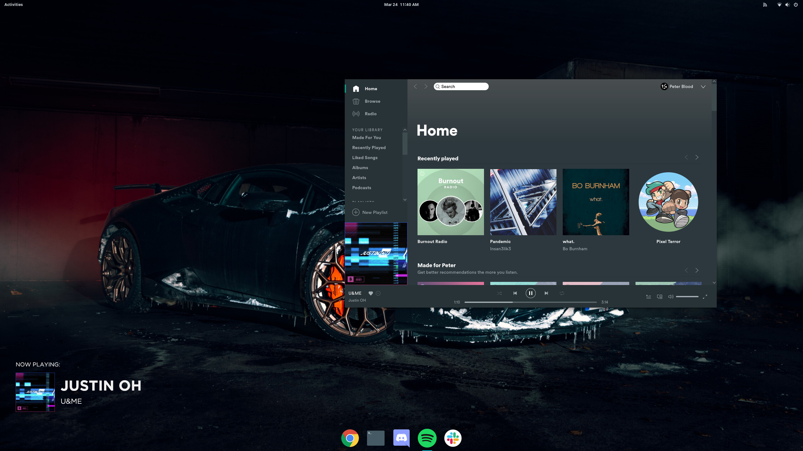

<h1 align="center">Now Clocking</h1>

<i>Made with :heart: by <a href="https://github.com/gamehelp16">@gamehelp16</a> and <a href="https://github.com/Rayzr522">@Rayzr522</a></i>

> **Now Clocking** is a Conky widget which shows a Monstercat style Now Playing when music is played via Spotify or cmus, or a clock when no music is playing.

## Outdated (below here)

## Dependencies

- [Spotify](https://www.spotify.com/)
- [cmus](https://cmus.github.io/)
- [ffmpeg](https://www.ffmpeg.org/)
- [dbus](https://www.freedesktop.org/wiki/Software/dbus/)

## Installation

1. Install the fonts "Gotham Bold", "Gotham Book", and "Montserrat Light".
2. Copy the files `cmusart` and `spotifyart` into `~/Documents`
3. Copy the folder `np` into your `.conky` folder.
4. Put the Conky widget into your desktop.
5. You might want to adjust the positioning of the widget since as said above, this widget is originally created for personal use only so I just made it specifically for my screen size, etc.

## Some questions you might ask

**Why are there 2 Conky widgets?**
Conky has this weird transparency issue where the album art becomes semi-transparent when the widget background is set to transparent. The album art only becomes opaque when the widget background is opaque (which of course looks really bad), so I figured out that using 2 widgets (one for the text, and another for the artwork) can solve the problem.

**Why separate the files used by each music player?**
I have tried merging `cmusart` and `spotifyart` into one file, I have also tried using only one file for the artwork and the text file, but this causes a bug where the artwork always re-downloads itself every time. So I think it's better to just use 2 files (once again this was initially created for personal use only).
